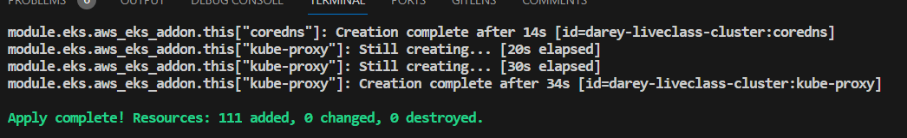

# **TASK**
Implement a seamless CI/CD pipeline for Terraform using Jenkins in this project, enabling automated testing,
deployment, and management of infrastructure-as-code with ease

**STEP 1**

Create a Docker container that runs Jenkins and Terraform cli.

1. create Dockerifle: 
    - the official Jenkins image which can be found [here](https://hub.docker.com/r/jenkins/jenkin) was used as base for the Dockerfile, and additional commands were integrated in the code for Terraform

2. build the Jenkins image from Dockerfile

    ` docker build -t jenkins-server <path to dockerfile> `

3. Run the image into a Docker container 

    `docker run -d -p 8080:8080 --name jenkins-server jenkins-server`

4. Check that the container is running with `docker ps`

    

**STEP 2**

Set up Jenkins server

- for this you will need to retrieve the initial Jenkins admin password so you will need to access Jenkins directly inside the container:

    - Use `docker exec -it  <containerID or container name>  /bin/bash` to enter and execute commands inside the container  
    
    - After you run this you will find yourself in the `/app` directory which is the `WORKDIR` defined inside the Dockerfile

    - then run `cat /var/jenkins_home/secrets/initialAdminPassword` to retrieve the admin password

- Install suggested Jenkins plugins and finish set up

- In Jenkins install these plugins: GitHub integration, AWS credentials, and Terraform 


**STEP 3**

Set up Git repository with Terraform code

I used the code from https://github.com/dareyio/terraform-aws-pipeline.git which provisions Kubernetes cluster using EKS

Changes to make to this code:

- Inside `provider.tf` change the configuration to reflect your own s3 bucket like in the image below, then push your changed to GitHub

    

Test that your configuration works by running Terraform init, plan and apply




**STEP 4**

Create credentials for GitHub and AWS secret and access keys

GitHub:

- create access token in GitHub
- within Jenkins, establish global credentials labeled as "Username with password," utilizing the access token as the password

AWS secrete and access keys:

- create credentials in Jenkins using the "AWS credentials" type
- for ID use `AWS_CRED`
- enter your IAM user Access and secret key in the designated spaces

    


**STEP 5**

Create and configure a Jenkins Multibranch pipeline 

Configure the following:
- Source: GitHub
- Script path: Jenkinsfile
- Credentials: the GitHub credentials you set up before
- add the repository URL (which you forked from https://github.com/dareyio/terraform-aws-pipeline.git ) 

The Jenkinsfile:

- Automates various stages of the development process including code checkout, planning infrastructure modifications using Terraform, and selectively applying those changes

- The primary goal is to establish a systematic approach to reviewing and implementing alterations to the infrastructure managed by Terraform

- Additionally, a manual checkpoint is incorporated to validate and approve changes before they are applied to crucial environments such as production. This ensures a controlled and secure deployment process for infrastructure changes

    


# Changes made to pipeline script:

The pipeline script from https://github.com/dareyio/terraform-aws-pipeline.git  was modified to include the following:


**1. Logging:**

Added echo statements before and after each stage to provide detailed logging. This enhances visibility in the Jenkins console output.


**2. Lint Code (Terraform Validate) Stage:**

Introduced a new stage named 'Lint Code' before 'Terraform Plan' to validate Terraform configurations using terraform validate.
This stage checks the syntax, consistency, and correctness of Terraform configuration files.


**3. Cleanup Stage:**

Added a 'Cleanup' stage that runs regardless of the success or failure of previous stages.
Included commands to clean up temporary files or state created by the pipeline.


**4. Comments:**

Added detailed comments for each stage and important commands to explain each stage and key commands, making it easier for anyone to understand and maintain the pipeline script.


**5. Error Handling:**

Introduced a try-catch block around the 'Terraform Apply' stage to catch exceptions and handle failures gracefully providing detailed error messages. In case of 'Terraform Apply' failure, a notification is sent and the build result is set to 'FAILURE'.


# Challenges faced with this project: 


**1. Deprecated Argument Replacement:**

- I encountered a deprecated argument, `resolve_conflicts`, and opted for the alternative `resolve_conflicts_on_create`.


**2. Command error:**

- When I ran `docker exec -it jenkins-server /bin/bash` to execute a command inside the container I got  this error: 

    

    I resolved this by running the command with bash only instead of /bin/bash so `docker exec -it jenkins-server bash`


**3. Terraform Apply Error Resolution:**

- While running Terraform apply in the terminal, the command took too long and resulted in an error.
- The issue was identified in **terraform-aws-pipeline/main.tf at line 330**.
The problematic code snippet:

    ```
    module "vpc_cni_irsa" {
    source  = "terraform-aws-modules/iam/aws//modules/iam-role-for-service-accounts-eks"
    version = "~> 5.0"

    role_name_prefix      = "VPC-CNI-IRSA"
    attach_vpc_cni_policy = true
    vpc_cni_enable_ipv6   = false

    ...
    ```

- The problem was resolved by changing `vpc_cni_enable_ipv6 = false` to `vpc_cni_enable_ipv4 = true`.


**4. Terraform Module Error Fix:**

- In **.terraform\modules\eks\modules\eks-managed-node-group\main.tf line 455**, there was an issue with the initial code snippet:


    ```
    resource "aws_autoscaling_schedule" "this" {
    for_each = { for k, v in var.schedules : k => v if var.create && var.create_schedule }

    scheduled_action_name  = each.key
    autoscaling_group_name = aws_eks_node_group.this[0].resources[0].autoscaling_groups[0].name

    min_size         = try(each.value.min_size, null)
    max_size         = try(each.value.max_size, null)
    desired_capacity = try(each.value.desired_size, null)
    start_time       = try(each.value.start_time, null)
    end_time         = try(each.value.end_time, null)
    time_zone        = try(each.value.time_zone, null)

    ...
    ```

- This caused an error, and the issue was related to the start time. I resolved it by setting the start time to a future date.

    

    The solution:
    
    


**5. Jenkins Console Approval Issue:**

- Initial Jenkins builds failed due to scripts requiring approval.

- The error was encountered in the Jenkins console, as depicted here: 

    

- A solution was found by approving the scripts, and further details can be found in this Stack Overflow [thread](https://stackoverflow.com/questions/38276341/jenkins-ci-pipeline-scripts-not-permitted-to-use-method-groovy-lang-groovyobject). 

- After script approval, the builds ran successfully.
     