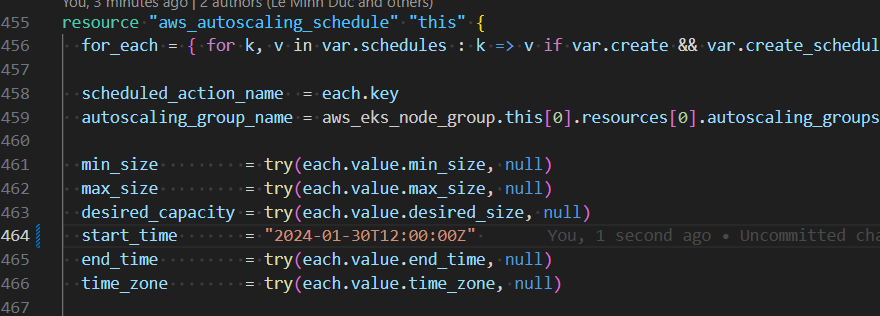

## Changes made to pipeline script:

**1. Logging:**

Added echo statements before and after each stage to provide detailed logging. This enhances visibility in the Jenkins console output.

**2. Lint Code (Terraform Validate) Stage:**

Introduced a new stage named 'Lint Code' before 'Terraform Plan' to validate Terraform configurations using terraform validate.
This stage checks the syntax, consistency, and correctness of Terraform configuration files.

**3. Cleanup Stage:**

Added a 'Cleanup' stage that runs regardless of the success or failure of previous stages.
Included commands to clean up temporary files or state created by the pipeline.

**4. Comments:**

Added detailed comments for each stage and important commands to explain each stage and key commands, making it easier for anyone to understand and maintain the pipeline script.

**5. Error Handling:**

Introduced a try-catch block around the 'Terraform Apply' stage to catch exceptions and handle failures gracefully providing detailed error messages. In case of 'Terraform Apply' failure, a notification is sent and the build result is set to 'FAILURE'.


## Challenges faced: 

**1. Deprecated Argument Replacement:**

- I encountered a deprecated argument, `resolve_conflicts`, and opted for the alternative `resolve_conflicts_on_create`.

**2. Terraform Apply Error Resolution:**

- While running Terraform apply in the terminal, the command took too long and resulted in an error.
- The issue was identified in **terraform-aws-pipeline/main.tf at line 330**.
The problematic code snippet:

    ```
    module "vpc_cni_irsa" {
    source  = "terraform-aws-modules/iam/aws//modules/iam-role-for-service-accounts-eks"
    version = "~> 5.0"

    role_name_prefix      = "VPC-CNI-IRSA"
    attach_vpc_cni_policy = true
    vpc_cni_enable_ipv6   = false

    ...
    ```

- The problem was resolved by changing `vpc_cni_enable_ipv6 = false` to `vpc_cni_enable_ipv4 = true`.


**3. Terraform Module Error Fix:**

- In **.terraform\modules\eks\modules\eks-managed-node-group\main.tf line 455**, there was an issue with the initial code snippet:


    ```
    resource "aws_autoscaling_schedule" "this" {
    for_each = { for k, v in var.schedules : k => v if var.create && var.create_schedule }

    scheduled_action_name  = each.key
    autoscaling_group_name = aws_eks_node_group.this[0].resources[0].autoscaling_groups[0].name

    min_size         = try(each.value.min_size, null)
    max_size         = try(each.value.max_size, null)
    desired_capacity = try(each.value.desired_size, null)
    start_time       = try(each.value.start_time, null)
    end_time         = try(each.value.end_time, null)
    time_zone        = try(each.value.time_zone, null)

    ...
    ```

- This caused an error, and the issue was related to the start time. I resolved it by setting the start time to a future date.

    

    The solution:
    
    


**4. Jenkins Console Approval Issue:**

- Initial Jenkins builds failed due to scripts requiring approval.

- The error was encountered in the Jenkins console, as depicted here: 

    

- A solution was found by approving the scripts, and further details can be found in this Stack Overflow [thread](https://stackoverflow.com/questions/38276341/jenkins-ci-pipeline-scripts-not-permitted-to-use-method-groovy-lang-groovyobject). 

- After script approval, the builds ran successfully.
     